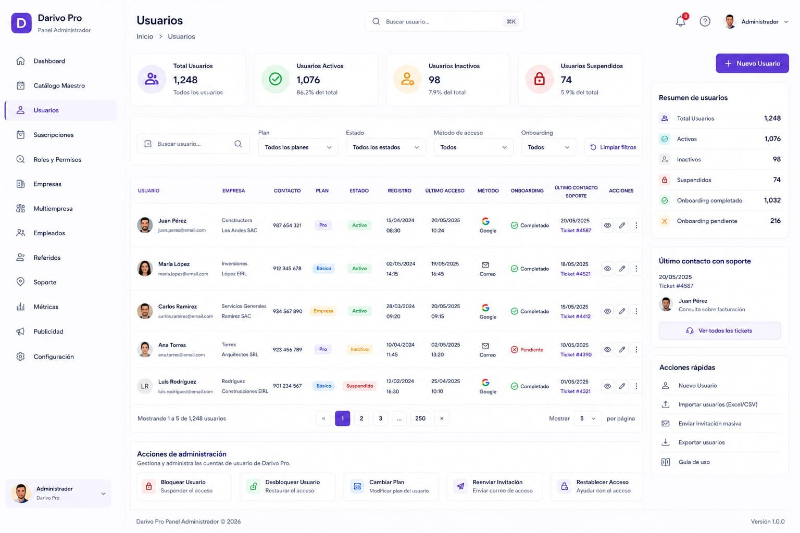

# 03 – PANEL ADMIN – USUARIOS

**Versión:** 1.3

**Estado:** Diseño oficial aprobado

**Cambio principal (v1.3 — 23/07/2026, decisión explícita del propietario, Tarea 3):** este módulo queda acotado a **correos e identidad de la cuenta** — alta/invitación, bloqueo, restablecimiento de acceso y datos de contacto. **La gestión del plan sale de aquí**: el plan es metadato de facturación y se administra desde `04-PANEL-ADMIN-SUSCRIPCIONES.md` §6.1 (pestaña "Cuentas"), con motivo obligatorio y registro de auditoría. Retirada en curso — ver §5.1.

**Cambio principal (v1.2 — 09/07/2026):** corrección documental. §4 añade la entrada real "Productos" del sidebar; catálogo de planes actualizado de 2 a los 3 planes reales (Básico/Pro/Business).

---

# 1. Objetivo

El módulo **Usuarios** permite administrar los usuarios registrados en Darivo Pro desde el Panel Administrador.

Este módulo pertenece al Panel Administrador.

Toda la administración de usuarios se realiza desde esta pantalla respetando las reglas oficiales del sistema.

---

# 2. Imagen oficial

**Archivo de imagen:**

`03-usuarios.png`

> La imagen oficial corresponde al diseño aprobado por el propietario.

### Uso de la imagen oficial

La imagen oficial tiene como único propósito servir como referencia visual del diseño aprobado.

La imagen permite identificar la distribución general de la pantalla, los componentes visibles y la apariencia del diseño.

La imagen **no constituye la documentación funcional del módulo**.

La descripción escrita de este documento MD es la única fuente oficial para documentar el comportamiento del módulo.

Si existe cualquier diferencia entre la imagen y el contenido del documento MD:

* Prevalece siempre el contenido del MD.
* No interpretar la imagen para crear funcionalidades.
* No inventar procesos, módulos, tablas, APIs, permisos o relaciones basándose únicamente en la imagen.
* Si existe cualquier duda o contradicción, detener el trabajo e informar al propietario antes de continuar.

---

# 3. Diseño oficial

La referencia visual es el diseño oficial aprobado de Darivo Pro Admin.

No modificar:

* Diseño.
* Colores.
* Tipografía.
* Componentes.
* Navegación.
* Iconografía.

---

# 4. Navegación del Panel Administrador

* Dashboard
* Productos
* Catálogo Maestro
* Usuarios *(módulo actual)*
* Gestión de Suscripciones
* Roles y Permisos
* Empresas
* Empleados
* Configuración de APIs
* Partners
* Soporte
* Configuración

---

# 5. Estructura de la pantalla

## Resumen superior

* Total usuarios
* Usuarios activos
* Usuarios inactivos
* Usuarios suspendidos

## Barra de herramientas

* Nuevo usuario
* Buscar usuario
* Filtro por plan
* Filtro por estado
* Filtro por método de acceso
* Filtro por onboarding
* Limpiar filtros

## Listado principal

Muestra la información de los usuarios registrados.

## Panel lateral

### Resumen de usuarios

* Total usuarios
* Activos
* Inactivos
* Suspendidos
* Onboarding completado
* Onboarding pendiente

### Último contacto con soporte

### Acciones rápidas

* Nuevo usuario
* Importar usuarios (Excel/CSV)
* Enviar invitación masiva
* Exportar usuarios
* Guía de uso

### Acciones de administración

* Bloquear usuario
* Desbloquear usuario
* Reenviar invitación
* Restablecer acceso

Todas son acciones de **correo e identidad**. Este módulo **no administra planes**.

## 5.1 "Cambiar plan" — retirada en curso (23/07/2026)

La acción **"Cambiar plan" deja de pertenecer a este módulo**. Su sitio oficial es Admin → Suscripciones → pestaña "Cuentas" (`04-PANEL-ADMIN-SUSCRIPCIONES.md` §6.1), donde exige motivo y queda auditada.

Estado real: el punto de entrada de este módulo sigue temporalmente disponible para no dejar el producto sin ninguna vía mientras el nuevo se verifica en vivo, pero ya **delega en la misma lógica** que Suscripciones, así que también queda registrado en el log de auditoría. En cuanto la verificación esté cerrada se elimina de aquí, y este documento pasa a describir el módulo sin ninguna mención a planes.

---

# 6. Información mostrada

El listado principal muestra:

* Usuario
* Empresa
* Contacto
* Plan
* Estado
* Fecha de registro
* Último acceso
* Método de acceso
* Estado del onboarding
* Último contacto con soporte
* Acciones

---

# 7. Relaciones

Este módulo forma parte del Panel Administrador.

## Catálogo de planes

El catálogo oficial de planes (**Básico**, **Pro** y **Business**) está definido únicamente en `04-PANEL-ADMIN-SUSCRIPCIONES.md` §6 (fuente única de precios y límites — no duplicar aquí).

Este módulo usa ese catálogo **solo para mostrar** el plan actual de cada usuario (lectura y filtro). **Cambiarlo no le corresponde** — ver §5.1.

No duplicar la definición de planes en este documento.

## Otras relaciones

Las relaciones con:

* Visión del Producto
* Base de Datos
* Arquitectura Maestra
* Arquitectura Darivo Pro Admin
* Roles y Permisos

se documentarán cuando dichos documentos estén finalizados y aprobados.

No definir relaciones ni dependencias hasta completar la documentación oficial.

---

# 8. Base de datos

Pendiente de documentación oficial.

No crear tablas.

No crear relaciones.

---

# 9. API

Pendiente de documentación oficial.

No crear endpoints.

---

# 10. Permisos

Los permisos oficiales del ecosistema están definidos en `12 – ROLES, PLANES Y PERMISOS – PANEL ADMIN.md` (§6–§8, §16).

Este MD no define permisos propios. En Darivo Pro Admin, el acceso a este módulo corresponde al rol **Administrador Darivo** (plataforma), conforme a `01-VISION-DEL-PRODUCTO.md` §8.

---

# 11. Reglas

* No inventar funcionalidades.
* No inventar procesos.
* No inventar permisos.
* No inventar relaciones.
* No modificar el diseño oficial.
* Documentar únicamente lo visible en el diseño aprobado.

---

# 12. Estado del documento

🟡 Documento de diseño oficial.

La documentación funcional se completará cuando el resto de documentos oficiales del proyecto estén finalizados y aprobados.

---

## Protección del documento oficial

Este documento MD forma parte de la documentación oficial de Darivo Pro.

**Solo el propietario del proyecto está autorizado a crear, modificar, reorganizar o eliminar este documento.**

Ninguna IA, herramienta o desarrollador podrá modificar este MD sin la autorización expresa del propietario.

Los documentos MD constituyen la única fuente oficial de documentación del proyecto.

Si una IA detecta un posible error, contradicción o información incompleta, deberá:

* Detener el trabajo.
* Informar al propietario.
* Esperar instrucciones.

Queda prohibido modificar este documento por iniciativa propia.

No asumir, completar o inventar información bajo ningún concepto.

**Fin del documento.**
