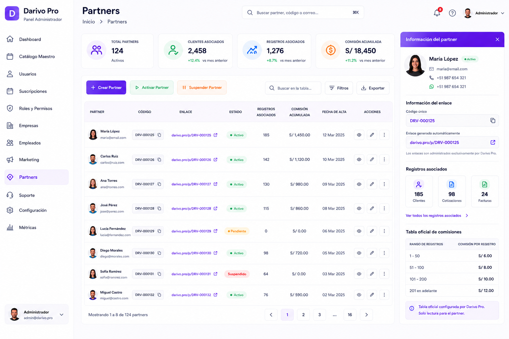

# 06 – PANEL ADMIN – PARTNERS

**Versión:** 1.8

**Estado:** Diseño oficial aprobado

**Cambio principal (v1.8 — 23/07/2026, pedido explícito del propietario):** queda escrito el límite de alcance de este módulo — administra el **programa de Partners** (alta, código, enlace, estado, comisiones, referidos), nunca datos operativos de las cuentas de cliente. Este módulo **no muestra ni consulta cotizaciones, clientes ni tarifas de ninguna cuenta** (`01-VISION-DEL-PRODUCTO.md` §4.1). Verificado en código el 23/07/2026: sus únicas fuentes son `partners`, `partner_referidos`, `partner_comisiones_config` y `partner_comisiones_historial`. Nota de ubicación: el **Panel Partner** propiamente dicho **no vive dentro de Admin** — es su propio panel en `/partner`, con layout, guard (`requireProducto("partner")`) y PWA independientes; lo que hay en Admin es este módulo de administración del programa, y esa separación es la correcta.

**Cambio principal (v1.7 — 21/07/2026, autorizado explícitamente por el propietario, Etapa 7 decisión 2):** decidido — un Partner **SÍ puede usar Darivo Pro Móvil**, pero únicamente si el Administrador Darivo lo activa explícitamente por partner (toggle "Acceso a Darivo Pro Móvil" en el panel de detalle de este módulo, desactivado por defecto, independiente de "Activar partner"/"Suspender partner" — nunca se activa automáticamente). Persistido en `partners.acceso_movil` (migración incluida, sin ejecutar). El enforcement real de ese acceso en el login/layout de Móvil **no se construyó todavía** (mismo criterio que el bloqueo de Admin — decisión declarativa primero, enforcement real es trabajo aparte); hoy el toggle solo queda guardado y visible en Admin.

**Cambio principal (v1.6 — 11/07/2026):** §5.1 "Plan regalado" documenta ahora la revocación implementada: al suspender/desactivar un Partner, su Plan Business otorgado por esa vía se revoca automáticamente a `gratis`, salvo que tenga un pago real propio de Business (nunca se revoca un plan pagado). Requiere `perfiles.plan_origen_partner_id` (migración pendiente de ejecución — ver `supabase/migrations/20260711130000_plan_origen_partner.sql`).

**Cambio principal (v1.5 — 11/07/2026):** añadida sección 5.3 — umbral mínimo de 3 clientes referidos activos en el ciclo para que un Partner reciba liquidación, como parte del proceso de revisión mensual manual.

**Cambio principal (v1.4 — 11/07/2026):** añadida sección 5.2 — requisito de negocio: registro histórico y auditable de cada comisión generada (no solo cálculo en vivo del tramo actual). Decisión de negocio, sin diseño de tabla todavía (pendiente de fase técnica). §10 actualizado con referencia cruzada.

**Cambio principal (v1.3 — 09/07/2026):** corrección documental. §4 añade la entrada real "Productos" del sidebar de Admin.

**Cambio principal (v1.2):** añadida sección 5.1 — plan oficial de comisiones (20% pago único por venta + bono escalonado por hitos 5/20/50/100+, individual por Partner). Derogada la tabla anterior por tramo de registros (S/6–S/12).

---

# 1. Objetivo

El módulo **Partners** permite administrar el programa oficial de Partners de Darivo Pro desde el Panel Administrador.

Este módulo pertenece al Panel Administrador.

El Panel Administrador es la **única fuente autorizada** para administrar los Partners, el programa de Partners, los códigos, los enlaces y la tabla oficial de comisiones.

---

# 2. Imagen oficial

**Archivo de imagen:**

`06-PANEL-ADMIN-PARTNERS.png`

> La imagen oficial corresponde al diseño aprobado por el propietario.

### Uso de la imagen oficial

La imagen oficial tiene como único propósito servir como referencia visual del diseño aprobado.

La imagen permite identificar la distribución general de la pantalla, los componentes visibles y la apariencia del diseño.

La imagen **no constituye la documentación funcional del módulo**.

La descripción escrita de este documento MD es la única fuente oficial para documentar el comportamiento del módulo.

Si existe cualquier diferencia entre la imagen y el contenido del documento MD:

* Prevalece siempre el contenido del MD.
* No interpretar la imagen para crear funcionalidades.
* No inventar procesos, módulos, tablas, APIs, permisos o relaciones basándose únicamente en la imagen.
* Si existe cualquier duda o contradicción, detener el trabajo e informar al propietario antes de continuar.

---

# 3. Diseño oficial

La referencia visual es el diseño oficial aprobado de Darivo Pro Admin.

No modificar:

* Diseño.
* Colores.
* Tipografía.
* Componentes.
* Navegación.
* Iconografía.

---

# 4. Navegación del Panel Administrador

* Dashboard
* Productos
* Catálogo Maestro
* Usuarios
* Gestión de Suscripciones
* Roles y Permisos
* Empresas
* Empleados
* Configuración de APIs
* Partners *(módulo actual)*
* Soporte
* Configuración

---

# 5. Estructura de la pantalla

## Indicadores superiores

* Total Partners
* Activos
* Pendientes
* Suspendidos

## Pestañas

* Todos los partners
* Activos
* Pendientes
* Suspendidos

## Acciones principales

* Nuevo partner
* Configurar tabla de comisiones
* Filtros

## Herramientas

* Buscar en la tabla
* Ordenar resultados
* Cambio de tipo de vista
* Paginación

## Funcionalidades oficiales

El Panel Administrador permite únicamente:

* Crear Partner.
* Activar Partner.
* Suspender Partner.
* Generar automáticamente un código único.
* Generar automáticamente un enlace único.
* Consultar los registros asociados al enlace del Partner.
* Configurar la tabla oficial de comisiones.
* Administrar el programa de Partners.

No documentar funcionalidades adicionales sin aprobación.

---

## 5.1 Plan oficial de comisiones (aprobado por el propietario 07/07/2026)

⚠️ **Sustituye y deroga por completo** cualquier tabla de comisiones anterior por tramo de registros (S/6–S/12 por registro). Esa tabla queda **oficialmente eliminada** — no debe volver a documentarse ni configurarse en el sistema.

### Comisión por venta

* **20% de comisión**, calculado sobre el primer pago del cliente referido.
* **Pago único** — no es recurrente, no se repite en meses siguientes del mismo cliente.

### Bono por hitos de clientes propios referidos

Bono adicional, calculado como **porcentaje sobre la facturación del tramo de clientes correspondiente a ese hito** (no sobre el acumulado total).

| Hito (clientes propios acumulados) | % del bono sobre ese tramo |
|---|---|
| 5 | 10% |
| 20 | 10% |
| 50 | 15% |
| 100 y cada 50 siguientes (150, 200, 250…) | 20% — techo permanente, no sigue subiendo |

* El hito se calcula **por Partner individual**, nunca de forma agregada entre varios Partners.
* A partir del hito de 100, el bono se mantiene fijo en 20% para todos los tramos posteriores — no hay un quinto escalón.

### Plan regalado

* Cada Partner activo recibe acceso gratuito al **Plan Business** mientras permanezca activo en el programa (`04-PANEL-ADMIN-SUSCRIPCIONES.md` §6).
* El otorgamiento es automático: al activar un Partner desde este módulo (con cuenta de usuario vinculada), su plan pasa a Business.

#### Revocación (implementado 11/07/2026)

* Al **suspender o desactivar** un Partner, su Plan Business otorgado por esta vía **se revoca automáticamente a `gratis`**.
* La revocación **nunca** afecta a un Partner que además tenga un **pago real y propio** de Plan Business — en ese caso el plan se queda en Business sin ningún cambio, aunque el Partner deje de estar activo.
* El sistema distingue ambos casos con la columna `perfiles.plan_origen_partner_id`: no nula únicamente cuando el Business vigente fue otorgado por ser Partner activo (nunca cuando fue pagado directamente). Si el usuario paga Business por su cuenta en cualquier momento, esa marca se limpia automáticamente y el plan deja de ser revocable.
* Esta lógica vive en `frontend/src/lib/activar-plan.ts` (`activarPlanUsuario`, `revocarBusinessSiFueRegaloPartner`) y se dispara desde `frontend/src/lib/ecosystem-store.ts` (`updatePartnerEstado`).

### Administración

Este plan de comisiones se configura y edita exclusivamente desde este módulo (Panel Admin → Partners → "Configurar tabla de comisiones"). Ningún otro documento ni pantalla puede duplicar estos porcentajes — deben referenciar esta sección.

---

## 5.2 Registro histórico y auditable de comisiones (decisión de negocio — 11/07/2026)

⚠️ Esta sección documenta un **requisito de negocio**, no un diseño técnico. La estructura de tabla, relaciones y campos exactos se define en una fase técnica posterior — ver §10.

El sistema **debe llevar un registro histórico y auditable de cada comisión generada** por Partner. No es suficiente calcular el tramo/hito vigente en vivo a partir del conteo actual de clientes propios referidos: cada comisión generada (venta individual o bono de hito) debe quedar registrada como un evento propio, inmutable una vez creado.

Cada registro de comisión debe conservar, como mínimo:

* **Referidos que tenía el Partner en el momento** en que se generó esa comisión (el conteo histórico, no el conteo actual).
* **Porcentaje aplicado** en ese momento (según el tramo/hito vigente entonces — §5.1).
* **Monto en soles** resultante de aplicar ese porcentaje.
* **Estado**: pendiente o pagada.

### Por qué es necesario (no solo preferible)

El bono por hitos (§5.1) se calcula **"sobre la facturación del tramo de clientes correspondiente a ese hito (no sobre el acumulado total)"**. Si el sistema recalculara el porcentaje en vivo cada vez que se consulta, un Partner que sube de tramo modificaría retroactivamente el porcentaje aplicado a comisiones de ventas ya ocurridas en un tramo anterior — un resultado incorrecto. Solo un registro persistido en el momento exacto de cada comisión evita este error.

### Alcance de esta decisión

* Aplica a la comisión por venta (20% pago único) y a cada bono por hito (§5.1) — cada uno genera su propio registro histórico independiente.
* El estado pendiente/pagada permite que Admin marque comisiones como pagadas sin perder el historial de cuándo y con qué porcentaje se generaron.
* No se definen aquí nombres de tabla, columnas, tipos de dato ni relaciones — eso es diseño técnico, fuera del alcance de esta sección (ver §10).

---

## 5.3 Umbral mínimo de liquidación (aprobado por el propietario — 11/07/2026)

Un Partner necesita **al menos 3 clientes referidos activos en el ciclo** para que se le pague la liquidación correspondiente a ese ciclo.

* Este umbral es una condición del **proceso de revisión mensual manual por Admin** (comisiones generadas — §5.2 — quedan en estado `pendiente` hasta esa revisión), no un cálculo automático adicional.
* No sustituye ni modifica los hitos de bono de §5.1 (5/20/50/100+) — es un requisito distinto: una puerta de entrada para que la liquidación del ciclo se procese, no un tramo de porcentaje.
* Las comisiones generadas (§5.2) para un Partner que no alcanza el umbral en un ciclo permanecen en estado `pendiente` — no se eliminan ni se recalculan, se acumulan hasta que el Partner alcance el umbral en un ciclo posterior.
* No documentar este umbral en `05-darivo-pro-partner/PANEL-PARTNER.md` sin aprobación — ese panel solo muestra el resultado (pendiente/pagada) y el rango de tiempo esperado, nunca el mecanismo de revisión interna (`PANEL-PARTNER.md` § Tiempos de pago).

---

# 6. Información mostrada

El listado principal muestra:

* Partner
* Código único
* Enlace único
* Registros asociados
* Estado
* Acciones

No documentar información adicional no visible en el diseño oficial.

"Registros asociados" son los correos de las cuentas referidas por ese Partner (`partner_referidos`) — dato del programa de Partners, necesario para calcular su comisión. **No incluye, ni puede incluir, el trabajo de esas cuentas**: ninguna cotización, cliente final, factura ni tarifa suya se muestra aquí (`01-VISION-DEL-PRODUCTO.md` §4.1).

---

# 7. Panel lateral

## Resumen

* Total Partners
* Activos
* Pendientes
* Suspendidos

## Información

Información general sobre el programa de Partners.

## Acciones rápidas

* Nuevo partner
* Configurar tabla de comisiones
* Consultar registros asociados
* Activar partner
* Suspender partner
* Guía de uso

---

# 8. Acciones disponibles

Según el diseño oficial:

* Crear partner
* Activar partner
* Suspender partner
* Activar / desactivar acceso a Darivo Pro Móvil por partner *(real desde v1.7, 21/07/2026 — toggle independiente de Activar/Suspender, desactivado por defecto)*
* Consultar registros asociados al enlace
* Configurar tabla de comisiones

No documentar funcionalidades adicionales sin aprobación.

---

# 9. Relaciones

Este módulo forma parte del Panel Administrador (`01-VISION-DEL-PRODUCTO.md` §4 y §8 — rol Administrador Darivo, Partners).

* `01-VISION-DEL-PRODUCTO.md` v2.5 §8 (Partners en roles de plataforma).
* `05-darivo-pro-partner/PANEL-PARTNER.md` (producto Partner).
* `12 – ROLES, PLANES Y PERMISOS – PANEL ADMIN.md`.

Las relaciones técnicas con Base de Datos y Arquitectura Maestra quedan reservadas para la fase final del proyecto.

---

# 10. Base de datos

Pendiente de documentación oficial.

No crear tablas.

No crear relaciones.

Cuando se diseñe, debe satisfacer el requisito de negocio de §5.2 (registro histórico y auditable de comisiones, con conteo de referidos/porcentaje/monto/estado por evento) — el diseño técnico de tabla sigue pendiente de una fase posterior.

---

# 11. API

Pendiente de documentación oficial.

No crear endpoints.

---

# 12. Permisos

Los permisos oficiales del ecosistema están definidos en `12 – ROLES, PLANES Y PERMISOS – PANEL ADMIN.md` (§6–§8, §16).

Este MD no define permisos propios. En Darivo Pro Admin, el acceso a este módulo corresponde al rol **Administrador Darivo** (plataforma), conforme a `01-VISION-DEL-PRODUCTO.md` §8.

---

# 13. Reglas

* No inventar funcionalidades.
* No inventar procesos.
* No inventar relaciones.
* No inventar APIs.
* No inventar tablas.
* No inventar permisos.
* No modificar el diseño oficial.
* No gestionar clientes desde este módulo.
* No gestionar material de marketing desde este módulo.
* No permitir que el Partner gestione su enlace.
* Documentar únicamente la información visible en el diseño aprobado.

## Reglas del enlace y del código

* El código único será generado automáticamente por el sistema al crear el Partner.
* El enlace único será generado automáticamente por el sistema al crear el Partner.
* Cada Partner tendrá un único enlace.
* El Partner no podrá crear, modificar, regenerar ni eliminar su enlace.
* El Panel Administrador es la única fuente autorizada para administrar los Partners.

---

# 14. Estado del documento

🟡 Documento de diseño oficial.

La documentación funcional se completará cuando el resto de documentos oficiales del proyecto estén finalizados y aprobados.

---

## Protección del documento oficial

Este documento MD forma parte de la documentación oficial de Darivo Pro.

**Solo el propietario del proyecto está autorizado a crear, modificar, reorganizar o eliminar este documento.**

Ninguna IA, herramienta o desarrollador podrá modificar este MD sin la autorización expresa del propietario.

Los documentos MD constituyen la única fuente oficial de documentación del proyecto.

Si una IA detecta un posible error, contradicción o información incompleta, deberá:

* Detener el trabajo.
* Informar al propietario.
* Esperar instrucciones.

Queda prohibido modificar este documento por iniciativa propia.

No asumir, completar o inventar información bajo ningún concepto.

**Fin del documento.**
