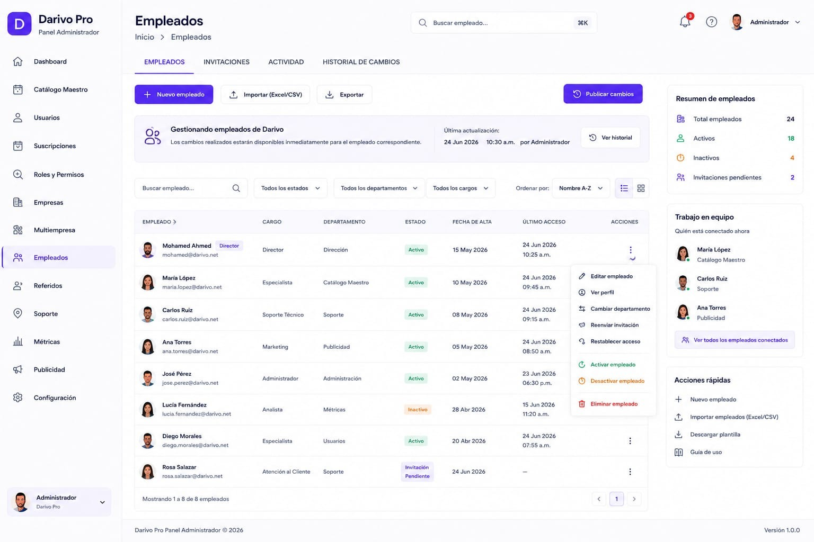

# 07 – PANEL ADMIN – EMPLEADOS

**Versión:** 1.1

**Estado:** Diseño oficial aprobado

**Cambio principal (v1.1 — 09/07/2026):** corrección documental. §4 añade la entrada real "Productos" del sidebar de Admin.

---

# 1. Objetivo

El módulo **Empleados** permite administrar los empleados internos de Darivo Pro desde el Panel Administrador.

Este módulo pertenece al Panel Administrador.

Toda la administración de empleados se realiza desde esta pantalla respetando las reglas oficiales del sistema.

---

# 2. Imagen oficial

**Archivo de imagen:**

`07-empleados.png`

> La imagen oficial corresponde al diseño aprobado por el propietario.

### Uso de la imagen oficial

La imagen oficial tiene como único propósito servir como referencia visual del diseño aprobado.

La imagen permite identificar la distribución general de la pantalla, los componentes visibles y la apariencia del diseño.

La imagen **no constituye la documentación funcional del módulo**.

La descripción escrita de este documento MD es la única fuente oficial para documentar el comportamiento del módulo.

Si existe cualquier diferencia entre la imagen y el contenido del documento MD:

* Prevalece siempre el contenido del MD.
* No interpretar la imagen para crear funcionalidades.
* No inventar procesos, módulos, tablas, APIs, permisos o relaciones basándose únicamente en la imagen.
* Si existe cualquier duda o contradicción, detener el trabajo e informar al propietario antes de continuar.

---

# 3. Diseño oficial

La referencia visual es el diseño oficial aprobado de Darivo Pro Admin.

No modificar:

* Diseño.
* Colores.
* Tipografía.
* Componentes.
* Navegación.
* Iconografía.

---

# 4. Navegación del Panel Administrador

* Dashboard
* Productos
* Catálogo Maestro
* Usuarios
* Gestión de Suscripciones
* Roles y Permisos
* Empresas
* Empleados *(módulo actual)*
* Configuración de APIs
* Partners
* Soporte
* Configuración

---

# 5. Estructura de la pantalla

## Pestañas

* Empleados
* Invitaciones
* Actividad
* Historial de cambios

## Acciones principales

* Nuevo empleado
* Importar (Excel/CSV)
* Exportar
* Publicar cambios
* Ver historial

## Filtros

* Buscar empleado
* Estado
* Departamento
* Cargo
* Orden
* Tipo de vista

---

# 6. Información mostrada

El listado principal muestra:

* Empleado
* Cargo
* Departamento
* Estado
* Fecha de alta
* Último acceso
* Acciones

---

# 7. Panel lateral

## Resumen de empleados

* Total empleados
* Activos
* Inactivos
* Invitaciones pendientes

## Trabajo en equipo

Empleados conectados actualmente.

## Acciones rápidas

* Nuevo empleado
* Importar empleados (Excel/CSV)
* Descargar plantilla
* Guía de uso

---

# 8. Acciones disponibles

Según el diseño oficial:

* Editar empleado
* Ver perfil
* Cambiar departamento
* Reenviar invitación
* Restablecer acceso
* Activar empleado
* Desactivar empleado
* Eliminar empleado

No documentar funcionalidades adicionales sin aprobación.

---

# 9. Relaciones

Este módulo forma parte del Panel Administrador (`01-VISION-DEL-PRODUCTO.md` §4).

* `01-VISION-DEL-PRODUCTO.md` v2.5 §8 (roles de plataforma y cliente).
* `12 – ROLES, PLANES Y PERMISOS – PANEL ADMIN.md` (asignación de permisos a empleados).
* `02-PANEL-ADMIN-EMPRESAS.md` (empresa del empleado).

Las relaciones técnicas con Base de Datos y Arquitectura Maestra quedan reservadas para la fase final del proyecto.

---

# 10. Base de datos

Pendiente de documentación oficial.

No crear tablas.

No crear relaciones.

---

# 11. API

Pendiente de documentación oficial.

No crear endpoints.

---

# 12. Permisos

Los permisos oficiales del ecosistema están definidos en `12 – ROLES, PLANES Y PERMISOS – PANEL ADMIN.md` (§6–§8, §16).

Este MD no define permisos propios. En Darivo Pro Admin, el acceso a este módulo corresponde al rol **Administrador Darivo** (plataforma), conforme a `01-VISION-DEL-PRODUCTO.md` §8.

---

# 13. Reglas

* No inventar funcionalidades.
* No inventar procesos.
* No inventar permisos.
* No inventar relaciones.
* No modificar el diseño oficial.
* Documentar únicamente lo visible en el diseño aprobado.

---

# 14. Estado del documento

🟡 Documento de diseño oficial.

La documentación funcional se completará cuando el resto de documentos oficiales del proyecto estén finalizados y aprobados.

---

## Protección del documento oficial

Este documento MD forma parte de la documentación oficial de Darivo Pro.

**Solo el propietario del proyecto está autorizado a crear, modificar, reorganizar o eliminar este documento.**

Ninguna IA, herramienta o desarrollador podrá modificar este MD sin la autorización expresa del propietario.

Los documentos MD constituyen la única fuente oficial de documentación del proyecto.

Si una IA detecta un posible error, contradicción o información incompleta, deberá:

* Detener el trabajo.
* Informar al propietario.
* Esperar instrucciones.

Queda prohibido modificar este documento por iniciativa propia.

No asumir, completar o inventar información bajo ningún concepto.

**Fin del documento.**
