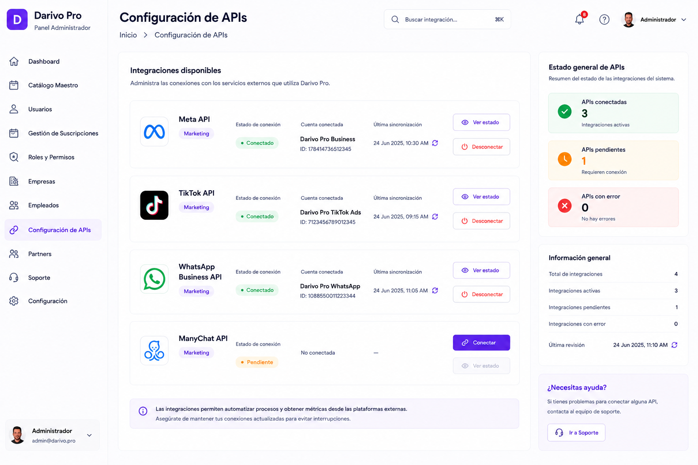

# 08 – PANEL ADMIN – CONFIGURACIÓN DE APIs

**Versión:** 2.2

**Estado:** ✅ Registro oficial de APIs — decisión propietario (02/07/2026)

**Cambio principal (v2.2 — 09/07/2026):** corrección documental. §4 añade la entrada real "Productos" del sidebar de Admin.

---

# 1. Objetivo

El módulo **Configuración de APIs** permite administrar las integraciones oficiales de Darivo Pro con servicios externos.

Este módulo pertenece al Panel Administrador.

Su finalidad es centralizar la configuración, el estado y la documentación oficial de todas las APIs utilizadas por Darivo Pro.

Este documento constituye el registro oficial de todas las integraciones externas del proyecto.

---

# 2. Imagen oficial

**Archivo de imagen:**

`08-PANEL-ADMIN-CONFIGURACION-DE-APIS.png`

> La imagen oficial corresponde al diseño aprobado por el propietario.

### Uso de la imagen oficial

La imagen oficial tiene como único propósito servir como referencia visual del diseño aprobado.

La imagen permite identificar la distribución general de la pantalla, los componentes visibles y la apariencia del diseño.

La imagen **no constituye la documentación funcional del módulo**.

La descripción escrita de este documento MD es la única fuente oficial para documentar el comportamiento del módulo.

Si existe cualquier diferencia entre la imagen y el contenido del documento MD:

* Prevalece siempre el contenido del MD.
* No interpretar la imagen para crear funcionalidades.
* No inventar procesos, módulos, tablas, APIs, permisos o relaciones basándose únicamente en la imagen.
* Si existe cualquier duda o contradicción, detener el trabajo e informar al propietario antes de continuar.

---

# 3. Diseño oficial

La referencia visual es el diseño oficial aprobado de Darivo Pro Admin.

No modificar:

* Diseño.
* Colores.
* Tipografía.
* Componentes.
* Navegación.
* Iconografía.

---

# 4. Navegación del Panel Administrador

* Dashboard
* Productos
* Catálogo Maestro
* Usuarios
* Gestión de Suscripciones
* Roles y Permisos
* Empresas
* Empleados
* Configuración de APIs *(módulo actual)*
* Partners
* Soporte
* Configuración

---

# 5. APIs oficiales aprobadas (versión actual)

> **Fuente única:** este apartado constituye el registro oficial de todas las APIs aprobadas del proyecto Darivo Pro.

## 5.1 Supabase

| Campo | Valor |
|-------|-------|
| **Estado** | ✅ Aprobada |
| **Uso** | Autenticación · Base de datos PostgreSQL · Storage · Row Level Security (RLS) |
| **Módulos** | Ecosistema completo (Admin · Móvil · Empresa · Partner) |
| **Observaciones** | Infraestructura central. Credenciales solo en `.env` / `.env.local`. |

## 5.2 OpenAI API

| Campo | Valor |
|-------|-------|
| **Estado** | ✅ Aprobada |
| **Uso** | Inteligencia Artificial del producto |
| **Módulos consumidores** | `01-darivo-pro-movil/08-MODULO-IA.md` (cotizaciones) · `01-darivo-pro-movil/09-MODULO-CIERRE.md` (análisis documentos gastos) · equivalentes Empresa `08-MODULO-IA-EMPRESA.md` · `09-MODULO-CIERRE-EMPRESA.md` |
| **Observaciones** | IA de **producto** (Visión §13). No confundir con IA de desarrollo (`22 – METODOLOGÍA OFICIAL DE IA – DARIVO PRO.md`). |

## 5.3 dLocal API

| Campo | Valor |
|-------|-------|
| **Estado** | ✅ Aprobada |
| **Uso** | Suscripciones · Cobros · Pagos |
| **Módulos consumidores** | `04-PANEL-ADMIN-SUSCRIPCIONES.md` · `01-darivo-pro-movil/07-MODULO-MAS.md` §8 (Mi Plan) · `07-MODULO-MAS-EMPRESA.md` §6 |
| **Observaciones** | Pasarela oficial. Producto comercial también referido como dLocal Go en Suscripciones. |

---

## 5.4 APIs pendientes

Las siguientes integraciones **no están aprobadas**. Se documentarán en este MD **únicamente** cuando el propietario las apruebe oficialmente.

| Integración | Estado | Referencia funcional |
|-------------|--------|----------------------|
| Facturación electrónica (SUNAT o proveedor autorizado) | ⏳ **Pendiente decisión del propietario** | `06-MODULO-FACTURAS.md` · `06-MODULO-FACTURAS-EMPRESA.md` |

---

## 5.5 APIs excluidas del producto

Las siguientes **no forman parte** de la lógica funcional de Darivo Pro y **no** deben registrarse como APIs del producto en módulos operativos:

| API | Motivo |
|-----|--------|
| **Meta WhatsApp Cloud API** | No utilizada por el producto. Los botones WhatsApp del producto (`wa.me`, Web Share) son enlaces del navegador — **no** integración Cloud API. |
| **Meta Marketing API / Meta Ads API** | Solo campañas publicitarias, métricas y gestión de anuncios. Ámbito de marketing — **independiente** de Darivo Pro. |

### Regla oficial — APIs de marketing

Las APIs de marketing **no forman parte** de la arquitectura funcional del producto y deberán documentarse de forma **independiente** de las APIs utilizadas por Darivo Pro.

---

## 5.6 Estructura de la pantalla (Panel Admin)

La pantalla del módulo listará las APIs del producto registradas en §5.1–§5.4:

* Nombre de la integración.
* Estado (activa / pendiente / error).
* Plataforma.
* Configuración.
* Última sincronización (si aplica).
* Acciones disponibles.

---

# 6. Información mostrada

Para cada API se mostrará:

* Nombre de la integración.
* Plataforma.
* Estado de la conexión.
* Descripción.
* Módulos que la utilizan.
* Estado de configuración.

---

# 7. Panel lateral

## Estado general

* APIs activas.
* APIs pendientes.
* APIs con error.

## Información

Resumen general del estado de las integraciones del sistema.

---

# 8. Relaciones

Este módulo forma parte del Panel Administrador (`01-VISION-DEL-PRODUCTO.md` §4).

* `12 – ROLES, PLANES Y PERMISOS – PANEL ADMIN.md`.
* Módulos consumidores documentados por API:
  * **Supabase** — ecosistema completo.
  * **OpenAI API** — `08-MODULO-IA.md` · `09-MODULO-CIERRE.md` (y equivalentes Empresa).
  * **dLocal API** — `04-PANEL-ADMIN-SUSCRIPCIONES.md` · Mi Plan (Móvil/Empresa).
  * **Facturación electrónica** — `06-MODULO-FACTURAS.md` — **solo cuando el propietario la apruebe** (§5.4).

Cada API registrada en este documento podrá ser utilizada por los módulos correspondientes del sistema.

Las relaciones técnicas con Base de Datos y Arquitectura Maestra quedan reservadas para la fase final del proyecto.

---

# 9. Base de datos

Pendiente de documentación oficial.

No crear tablas.

No crear relaciones.

---

# 10. Registro y reglas oficiales

Este documento constituye el **registro oficial de todas las APIs externas utilizadas por Darivo Pro**.

### APIs aprobadas (versión actual)

1. **Supabase** — §5.1  
2. **OpenAI API** — §5.2  
3. **dLocal API** — §5.3  

### Reglas oficiales

* **No añadir** nuevas APIs sin aprobación expresa del propietario en este MD.
* **No cambiar** proveedores sin nueva decisión documentada del propietario.
* **No documentar** integraciones que no hayan sido aprobadas oficialmente.
* Las **APIs de marketing** (Meta Ads, etc.) se documentan **independientemente** — §5.5.

Ningún otro documento MD podrá registrar una API externa de negocio del producto si no figura en §5.1–§5.3.

Los demás módulos únicamente podrán **referenciar** las APIs registradas oficialmente en **Configuración de APIs**.

---

# 11. Permisos

Los permisos oficiales del ecosistema están definidos en `12 – ROLES, PLANES Y PERMISOS – PANEL ADMIN.md` (§6–§8, §16).

Este MD no define permisos propios. En Darivo Pro Admin, el acceso a este módulo corresponde al rol **Administrador Darivo** (plataforma), conforme a `01-VISION-DEL-PRODUCTO.md` §8.

---

# 12. Reglas

* No inventar funcionalidades.
* No inventar APIs.
* No inventar integraciones.
* No modificar el diseño oficial.
* Toda API deberá documentarse primero en este MD (§5).
* Ningún módulo podrá utilizar una API no registrada oficialmente.
* **No añadir** nuevas APIs · **No cambiar** proveedores · **No documentar** integraciones no aprobadas — salvo decisión expresa del propietario.

---

# 13. Estado del documento

✅ **Registro oficial de APIs** — versión actual v2.1 (02/07/2026).

Aprobadas: §5.1–§5.3 · Pendientes: §5.4 · Excluidas del producto: §5.5.

---

## Protección del documento oficial

Este documento MD forma parte de la documentación oficial de Darivo Pro.

**Solo el propietario del proyecto está autorizado a crear, modificar, reorganizar o eliminar este documento.**

Ninguna IA, herramienta o desarrollador podrá modificar este MD sin la autorización expresa del propietario.

Los documentos MD constituyen la única fuente oficial de documentación del proyecto.

Si una IA detecta un posible error, contradicción o información incompleta, deberá:

* Detener el trabajo.
* Informar al propietario.
* Esperar instrucciones.

Queda prohibido modificar este documento por iniciativa propia.

No asumir, completar o inventar información bajo ningún concepto.

**Fin del documento.**
