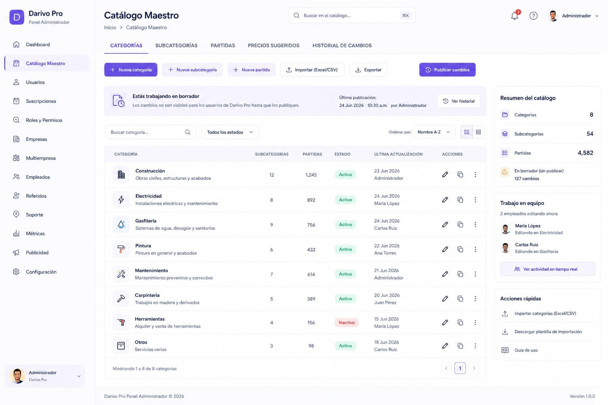

# MD-10 – PANEL ADMIN – CATÁLOGO MAESTRO

**Versión:** 1.3

**Estado:** Diseño oficial aprobado

**Cambio principal (v1.3 — 18/07/2026):** corrección documental. §9/§10 quedaban desactualizados — decían "Pendiente de documentación oficial, no crear tablas/endpoints" pese a que el CRUD real (categorías y partidas, sobre las 4 tablas ya existentes del Doc 21, sin tablas nuevas) se construyó el 13/07/2026 dentro de la tanda autorizada de Admin. Detectada la contradicción el 18/07/2026, reportada al propietario sin tocar código, y confirmada por él como autorizada ("ya") — este cambio documenta esa confirmación, no autoriza nada nuevo por iniciativa propia.

**Cambio anterior (v1.2 — 09/07/2026):** corrección documental. §4 añade la entrada real "Productos" del sidebar de Admin.

---

# 1. Objetivo

El módulo **Catálogo Maestro** permite administrar el catálogo oficial utilizado por Darivo Pro.

Este módulo pertenece al **Panel Administrador**.

Toda modificación realizada en este módulo afectará al catálogo oficial de la plataforma según la configuración y permisos definidos por Darivo Pro.

## Administración exclusiva

El **Catálogo Maestro** tiene una única administración oficial.

Su gestión corresponde exclusivamente a **Darivo Pro Admin**.

Desde este módulo se crean, modifican, actualizan y mantienen los servicios, materiales, categorías y la Tarifa Pro.

Ningún otro producto puede administrar el Catálogo Maestro.

La personalización de cada empresa se realiza mediante **Mis Tarifas**, gestionadas por el **Gerente** desde Darivo Pro Empresa y Darivo Pro Móvil, sin modificar el Catálogo Maestro (`01-VISION-DEL-PRODUCTO.md` §11; Doc 21 §8 y §19).

---

# 2. Imagen oficial

**Archivo de imagen:**

`10-catalogo-maestro.png`



> La imagen oficial corresponde al diseño aprobado por el propietario.

### Uso de la imagen oficial

La imagen oficial tiene como único propósito servir como referencia visual del diseño aprobado.

La imagen permite identificar la distribución general de la pantalla, los componentes visibles y la apariencia del diseño.

La imagen **no constituye la documentación funcional del módulo**.

La descripción escrita de este documento MD es la única fuente oficial para documentar el comportamiento del módulo.

Si existe cualquier diferencia entre la imagen y el contenido del documento MD:

* Prevalece siempre el contenido del MD.
* No interpretar la imagen para crear funcionalidades.
* No inventar procesos, módulos, tablas, APIs, permisos o relaciones basándose únicamente en la imagen.
* Si existe cualquier duda o contradicción, detener el trabajo e informar al propietario antes de continuar.

---

# 3. Diseño oficial

La referencia visual es el diseño oficial aprobado de **Darivo Pro Admin**.

No modificar:

* Diseño.
* Colores.
* Tipografía.
* Componentes.
* Navegación.
* Iconografía.

---

# 4. Navegación del Panel Administrador

El módulo **Catálogo Maestro** forma parte del Panel Administrador de Darivo Pro.

La navegación oficial del Panel Administrador es:

* Dashboard
* Productos
* Catálogo Maestro *(módulo actual)*
* Usuarios
* Gestión de Suscripciones
* Roles y Permisos
* Empresas
* Empleados
* Configuración de APIs
* Partners
* Soporte
* Configuración

---

# 5. Estructura de la pantalla

La pantalla contiene las siguientes pestañas:

* Categorías
* Subcategorías
* Partidas
* Precios sugeridos
* Historial de cambios

---

# 6. Acciones visibles

Según el diseño aprobado:

* Nueva categoría
* Nueva subcategoría
* Nueva partida
* Importar (Excel/CSV)
* Exportar
* Publicar cambios
* Buscar
* Filtrar por estado
* Ordenar
* Cambiar tipo de vista
* Ver historial

No documentar funcionalidades adicionales sin aprobación.

---

# 7. Información mostrada

El listado principal muestra:

* Categoría
* Número de subcategorías
* Número de partidas
* Estado
* Última actualización
* Usuario que realizó la actualización
* Acciones

El panel lateral muestra:

## Resumen del catálogo

* Categorías
* Subcategorías
* Partidas
* Cambios pendientes de publicación

## Trabajo en equipo

Usuarios editando el catálogo.

## Acciones rápidas

* Importar categorías
* Descargar plantilla de importación
* Guía de uso

---

# 8. Arquitectura funcional oficial

Este módulo implementa la arquitectura definida en el **Documento 21 – ARQUITECTURA DEL CATÁLOGO MAESTRO, TARIFA PRO Y MOTOR DE COTIZACIÓN – DARIVO PRO**. Todos los cambios realizados aquí siguen las reglas definidas en ese documento.

## Sectores profesionales (Doc 21 §5)

El Catálogo Maestro se organiza por sectores profesionales. Ejemplos:

* Construcción
* Electricidad
* Gasfitería
* Pintura
* Carpintería
* Drywall
* Climatización
* Jardinería
* Mantenimiento
* Limpieza
* Otros

Cada plantilla de negocio pertenece a uno o varios sectores.

## Plantillas de negocio (Doc 21 §6)

Cada sector dispone de una plantilla preparada por Darivo que contiene: categorías, partidas, tipo de cálculo, tipo de precio, Tarifa Pro y estado.

## Tarifa Pro (Doc 21 §9)

La Tarifa Pro pertenece exclusivamente a Darivo. Desde este módulo se administran los precios de referencia oficiales. La empresa nunca modifica la Tarifa Pro.

Darivo puede actualizar la Tarifa Pro añadiendo partidas, categorías, sectores o mejorando plantillas y precios. Las actualizaciones nunca eliminan ni sobrescriben las personalizaciones de las empresas (Doc 21 §18).

## Motor de Cotización (Doc 21 §11 y §13)

Cuando una empresa crea una cotización, el motor resuelve automáticamente el precio de cada partida siguiendo esta prioridad:

```
1. Mis Tarifas de la empresa (precio personalizado)
   ↓ si no existe
2. Tarifa Pro (precio oficial del Catálogo Maestro)
```

El usuario nunca decide qué precio utilizar. El motor calcula el importe automáticamente según el tipo de cálculo de cada partida en el paso **Cantidades** del wizard (Doc 21 §12–§16 · `05-MODULO-COTIZACIONES.md` Reglas 4–5).

## Subcategorías (Doc 21 §15)

Las subcategorías son únicamente de navegación en la interfaz. Aplican exclusivamente al sector **Construcción**, que por su volumen de partidas requiere un nivel adicional de navegación (Albañilería, Cimentaciones, Estructuras, Encofrados, Techos, Pisos, Acabados, etc.) antes de acceder a las partidas.

El resto de categorías muestran directamente sus partidas sin subcategorías.

Las subcategorías no crean un nuevo nivel en la base de datos ni modifican la arquitectura del Catálogo Maestro.

## Relaciones

Este módulo forma parte del Panel Administrador.

* Referencia arquitectónica: `21 – ARQUITECTURA DEL CATÁLOGO MAESTRO, TARIFA PRO Y MOTOR DE COTIZACIÓN – DARIVO PRO.md`
* Módulo consumidor principal: `05-MODULO-COTIZACIONES.md` (Darivo Pro)
* Personalización empresa: `07-MODULO-MAS.md` (Mis Tarifas — pestaña Mis Tarifas)

Las relaciones con Base de Datos, Roles y Permisos se documentarán cuando los documentos oficiales correspondientes estén finalizados y aprobados.

---

# 9. Base de datos

CRUD real construido (13/07/2026, confirmado autorizado por el propietario 18/07/2026) sobre las 4 tablas ya existentes del Doc 21 — sin tablas nuevas: `catalogo_sectores` (solo lectura, referencia fija), `catalogo_categorias_maestro`, `catalogo_partidas_maestro` (CRUD completo). No se crearon relaciones nuevas.

---

# 10. API

CRUD real construido vía Server Actions de Next.js (`frontend/src/app/admin/catalogo/actions.ts`, 13/07/2026, confirmado autorizado por el propietario 18/07/2026): `crearCategoriaAction`, `editarCategoriaAction`, `eliminarCategoriaAction`, `crearPartidaAction`, `editarPartidaAction`, `eliminarPartidaAction`. No hay endpoints REST propios (`app/api/...`) — el patrón de este proyecto usa Server Actions para las mutaciones de Admin, no una API separada.

---

# 11. Permisos

Los permisos oficiales del ecosistema están definidos en `12 – ROLES, PLANES Y PERMISOS – PANEL ADMIN.md` (§6–§8, §16).

Este MD no define permisos propios. En Darivo Pro Admin, el acceso a este módulo corresponde al rol **Administrador Darivo** (plataforma), conforme a `01-VISION-DEL-PRODUCTO.md` §8.

---

# 12. Reglas

* No inventar funcionalidades.
* No inventar categorías.
* No inventar subcategorías.
* No inventar partidas.
* No inventar botones.
* No inventar procesos.
* No inventar permisos.
* No inventar relaciones.
* No modificar el diseño oficial.

---

# 13. Estado del documento

🟢 Documento de diseño oficial con arquitectura funcional sincronizada con el Documento 21.

§9 (Base de Datos) y §10 (API) documentan el CRUD real ya construido y autorizado (18/07/2026). La documentación formal de Permisos se completará cuando el documento oficial correspondiente esté finalizado y aprobado.

---

## Protección del documento oficial

Este documento MD forma parte de la documentación oficial de Darivo Pro.

**Solo el propietario del proyecto está autorizado a crear, modificar, reorganizar o eliminar este documento.**

Ninguna IA, herramienta o desarrollador podrá modificar este MD sin la autorización expresa del propietario.

Los documentos MD constituyen la única fuente oficial de documentación del proyecto.

Si una IA detecta un posible error, contradicción o información incompleta, deberá:

* Detener el trabajo.
* Informar al propietario.
* Esperar instrucciones.

Queda prohibido modificar este documento por iniciativa propia.

No asumir, completar o inventar información bajo ningún concepto.

**Fin del documento.**
