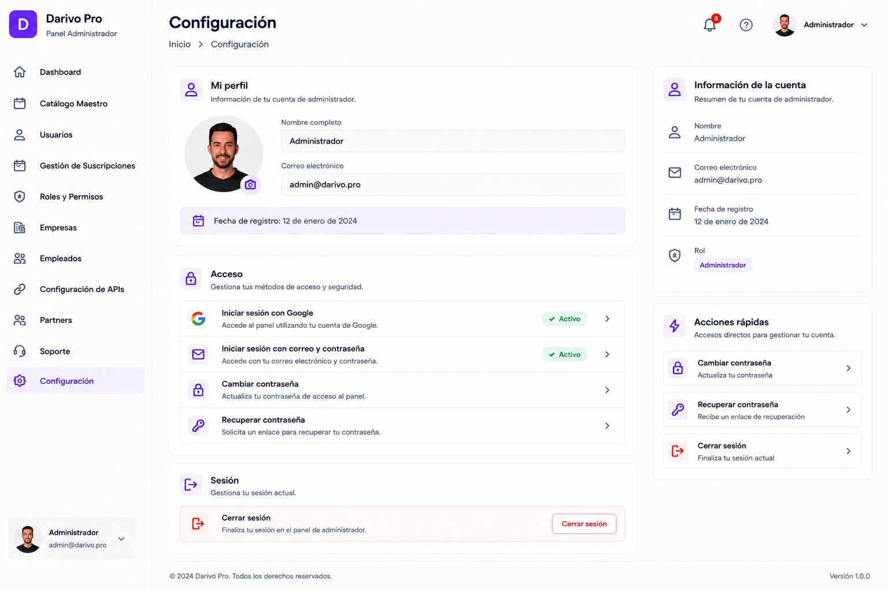

# 11 – PANEL ADMIN – CONFIGURACIÓN

**Versión:** 1.0

**Estado:** Diseño oficial aprobado

---

# 1. Objetivo

El módulo **Configuración** permite al administrador gestionar únicamente su propia cuenta de acceso al Panel Administrador de Darivo Pro.

Este módulo pertenece al Panel Administrador.

Su finalidad es ofrecer una gestión sencilla del perfil y de las credenciales de acceso.

No administra configuraciones del sistema ni funcionalidades pertenecientes a otros módulos.

---

# 2. Imagen oficial

**Archivo de imagen:**

`11-PANEL-ADMIN-CONFIGURACION.png`

> La imagen oficial corresponde al diseño aprobado por el propietario.

### Uso de la imagen oficial

La imagen oficial tiene como único propósito servir como referencia visual del diseño aprobado.

La imagen permite identificar la distribución general de la pantalla, los componentes visibles y la apariencia del diseño.

La imagen **no constituye la documentación funcional del módulo**.

La descripción escrita de este documento MD es la única fuente oficial para documentar el comportamiento del módulo.

Si existe cualquier diferencia entre la imagen y el contenido del documento MD:

* Prevalece siempre el contenido del MD.
* No interpretar la imagen para crear funcionalidades.
* No inventar procesos, módulos, tablas, APIs, permisos o relaciones basándose únicamente en la imagen.
* Si existe cualquier duda o contradicción, detener el trabajo e informar al propietario antes de continuar.

---

# 3. Diseño oficial

La referencia visual es el diseño oficial aprobado de Darivo Pro Admin.

No modificar:

* Diseño.
* Colores.
* Tipografía.
* Componentes.
* Navegación.
* Iconografía.

---

# 4. Navegación del Panel Administrador

* Dashboard
* Catálogo Maestro
* Usuarios
* Gestión de Suscripciones
* Roles y Permisos
* Empresas
* Empleados
* Configuración de APIs
* Partners
* Soporte
* Configuración *(módulo actual)*

---

# 5. Estructura de la pantalla

## Mi perfil

* Fotografía.
* Nombre.
* Correo electrónico.

## Acceso

* Iniciar sesión con Google.
* Iniciar sesión con correo electrónico y contraseña.
* Cambiar contraseña.
* Recuperar contraseña.

## Sesión

* Cerrar sesión.

---

# 6. Información mostrada

La pantalla mostrará únicamente:

* Fotografía del administrador.
* Nombre.
* Correo electrónico.
* Método de acceso.
* Fecha de registro.
* Acciones disponibles.

---

# 7. Panel lateral

## Información de la cuenta

* Nombre.
* Correo electrónico.
* Fecha de registro.

## Acciones rápidas

* Cambiar contraseña.
* Recuperar contraseña.
* Cerrar sesión.

---

# 8. Relaciones

Este módulo forma parte del Panel Administrador (`01-VISION-DEL-PRODUCTO.md` §4).

Gestiona exclusivamente el perfil y credenciales del **Administrador Darivo** conectado.

* `12 – ROLES, PLANES Y PERMISOS – PANEL ADMIN.md` §6.1 (Administrador Darivo).
* `03-PANEL-ADMIN-USUARIOS.md` (gestión de usuarios de la plataforma — ámbito distinto).

Las relaciones técnicas con Base de Datos y Arquitectura Maestra quedan reservadas para la fase final del proyecto.

---

# 9. Base de datos

Pendiente de documentación oficial.

No crear tablas.

No crear relaciones.

---

# 10. API

La autenticación podrá realizarse mediante:

* Inicio de sesión con Google.
* Inicio de sesión con correo electrónico y contraseña.

La recuperación de contraseña utilizará el sistema oficial de autenticación aprobado para Darivo Pro.

No documentar endpoints hasta la definición técnica oficial.

---

# 11. Permisos

Los permisos oficiales del ecosistema están definidos en `12 – ROLES, PLANES Y PERMISOS – PANEL ADMIN.md` (§6–§8, §16).

Este MD no define permisos propios. En Darivo Pro Admin, el acceso a este módulo corresponde al rol **Administrador Darivo** (plataforma), conforme a `01-VISION-DEL-PRODUCTO.md` §8.

---

# 12. Reglas

* No inventar funcionalidades.
* No administrar configuraciones del sistema.
* No administrar usuarios.
* No administrar empresas.
* No administrar APIs.
* No administrar Partners.
* No administrar suscripciones.
* No administrar soporte.
* No modificar el diseño oficial.
* Este módulo gestiona únicamente la cuenta del administrador.
* Mantener el módulo lo más simple posible.

---

# 13. Estado del documento

🟡 Documento de diseño oficial.

La documentación funcional se completará cuando el resto de documentos oficiales del proyecto estén finalizados y aprobados.

---

## Protección del documento oficial

Este documento MD forma parte de la documentación oficial de Darivo Pro.

**Solo el propietario del proyecto está autorizado a crear, modificar, reorganizar o eliminar este documento.**

Ninguna IA, herramienta o desarrollador podrá modificar este MD sin la autorización expresa del propietario.

Los documentos MD constituyen la única fuente oficial de documentación del proyecto.

Si una IA detecta un posible error, contradicción o información incompleta, deberá:

* Detener el trabajo.
* Informar al propietario.
* Esperar instrucciones.

Queda prohibido modificar este documento por iniciativa propia.

No asumir, completar o inventar información bajo ningún concepto.

**Fin del documento.**
