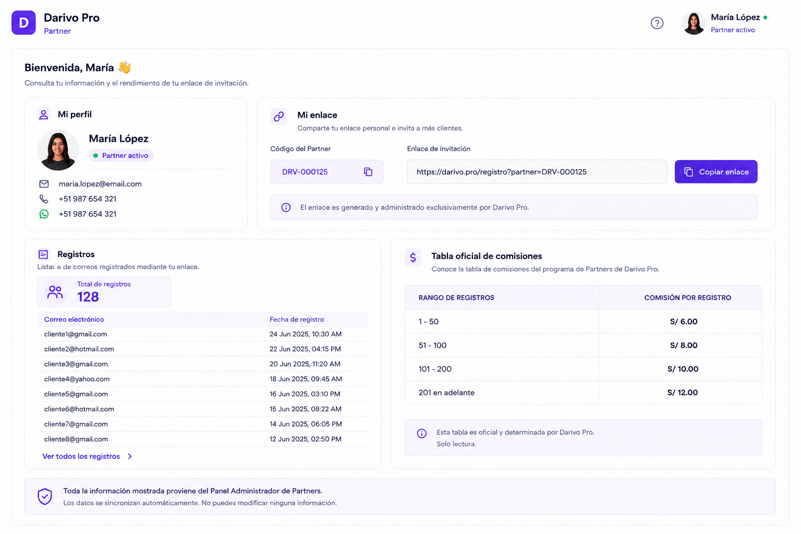

# PANEL PARTNER

**Versión:** 1.1

**Estado:** Diseño oficial aprobado

**Cambio principal (v1.1):** detallado qué ve el Partner de la tabla de comisiones (20% pago único + hitos 5/20/50/100+), referenciando `06-PANEL-ADMIN-PARTNERS.md` §5.1 como fuente única.

---

# 1. Objetivo

El **Panel Partner** permite al Partner consultar la información relacionada con su participación en el programa oficial de Partners de Darivo Pro.

Este panel pertenece al programa oficial de Partners.

Toda la información mostrada se sincroniza con el Panel Administrador de Partners.

El Partner únicamente puede consultar la información autorizada y copiar su enlace de invitación.

---

# 2. Imagen oficial

**Archivo de imagen:**

`PANEL-PARTNER.png`

> La imagen oficial corresponde al diseño aprobado por el propietario.

### Uso de la imagen oficial

La imagen oficial tiene como único propósito servir como referencia visual del diseño aprobado.

La imagen permite identificar la distribución general de la pantalla, los componentes visibles y la apariencia del diseño.

La imagen **no constituye la documentación funcional del panel**.

La descripción escrita de este documento MD es la única fuente oficial para documentar el comportamiento del módulo.

Si existe cualquier diferencia entre la imagen y el contenido del documento MD:

* Prevalece siempre el contenido del MD.
* No interpretar la imagen para crear funcionalidades.
* No inventar procesos, módulos, tablas, APIs, permisos o relaciones basándose únicamente en la imagen.
* Si existe cualquier duda o contradicción, detener el trabajo e informar al propietario antes de continuar.

---

# 3. Diseño oficial

La referencia visual es el diseño oficial aprobado del Panel Partner.

No modificar:

* Diseño.
* Colores.
* Tipografía.
* Componentes.
* Navegación.
* Iconografía.

---

# 4. Estructura de la pantalla

El Panel Partner está formado por **una única página**.

No existen menús internos ni módulos adicionales.

La pantalla muestra:

## Mi perfil

* Nombre.
* Correo electrónico.
* Teléfono.
* WhatsApp.

## Mi enlace

* Código del Partner.
* Enlace generado automáticamente por Darivo Pro.

Acción disponible:

* Copiar enlace.

## Registros

* Total de registros.
* Lista de correos electrónicos registrados mediante el enlace del Partner.
* Fecha de registro.

## Tabla oficial de comisiones

Visualización de la tabla oficial de comisiones.

Solo lectura.

El Partner ve, como mínimo:

* Comisión por venta: **20%, pago único**, al momento de la venta del cliente referido.
* Sus hitos personales alcanzados y pendientes (5, 20, 50, y cada 50 a partir de 100), con el % de bono correspondiente a cada uno (10% / 10% / 15% / 20%).
* Progreso actual hacia su siguiente hito (ej. "38 de 50 clientes").

Fuente y definición completa: `02-darivo-pro-admin/06-PANEL-ADMIN-PARTNERS.md` §5.1 — este panel solo la muestra, nunca la define ni la duplica.

---

# 5. Sincronización

Toda la información mostrada proviene del Panel Administrador de Partners.

El Partner no puede modificar ninguna información.

---

# 6. Relaciones

Este panel mantiene sincronización con:

* Panel Admin – Partners.
* Visión del Producto.
* Base de Datos.
* Arquitectura Maestra.
* Roles y Permisos.

---

# 7. Base de datos

Pendiente de documentación oficial.

No crear tablas.

No crear relaciones.

---

# 8. API

Pendiente de documentación oficial.

No crear endpoints.

---

# 9. Permisos

Pendiente del documento oficial de Roles y Permisos.

No documentar permisos en este MD.

---

# 10. Reglas

* No inventar funcionalidades.
* No inventar procesos.
* No inventar relaciones.
* No inventar APIs.
* No inventar tablas.
* No inventar permisos.
* No modificar el diseño oficial.
* El enlace será generado exclusivamente desde el Panel Administrador.
* El Partner únicamente podrá copiar su enlace.
* El Partner únicamente podrá consultar los registros realizados mediante su enlace.
* El Partner únicamente podrá consultar la tabla oficial de comisiones.
* No podrá modificar ninguna información.

---

# 11. Estado del documento

🟡 Documento de diseño oficial.

La documentación funcional se completará cuando el resto de documentos oficiales del proyecto estén finalizados y aprobados.

---

## Protección del documento oficial

Este documento MD forma parte de la documentación oficial de Darivo Pro.

**Solo el propietario del proyecto está autorizado a crear, modificar, reorganizar o eliminar este documento.**

Ninguna IA, herramienta o desarrollador podrá modificar este MD sin la autorización expresa del propietario.

Los documentos MD constituyen la única fuente oficial de documentación del proyecto.

Si una IA detecta un posible error, contradicción o información incompleta, deberá:

* Detener el trabajo.
* Informar al propietario.
* Esperar instrucciones.

Queda prohibido modificar este documento por iniciativa propia.

No asumir, completar o inventar información bajo ningún concepto.

**Fin del documento.**
